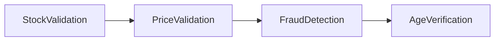
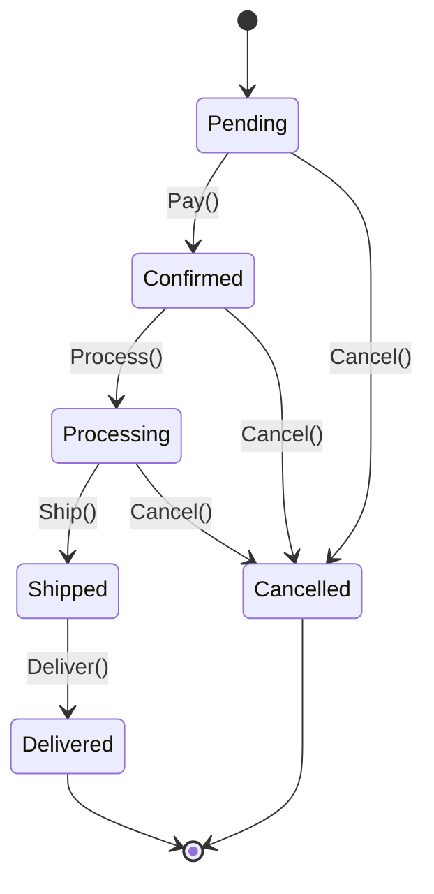
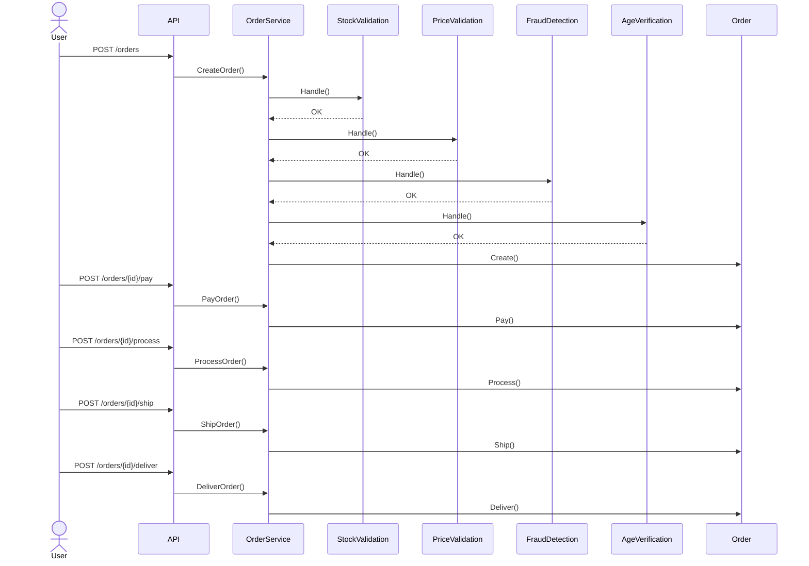
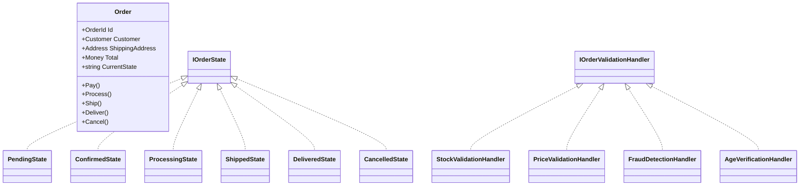

# OrderProcessing — Lab 4

## Descriere

Aplicație ASP.NET Core Web API + SPA vanilla JavaScript care demonstrează pattern-urile:

- Chain of Responsibility
- State Pattern

Aplicația permite:
- creare comenzi
- validare pipeline
- tranziții de stare
- vizualizare state machine
- afișare istoric tranziții

---

# Pattern 1 — Chain of Responsibility

Pipeline-ul de validare este:



Primul handler care detectează o problemă oprește pipeline-ul și returnează:

```text
ValidationResult.Failed()
```

Handler-ele implementate:

- StockValidationHandler
- PriceValidationHandler
- FraudDetectionHandler
- AgeVerificationHandler

---

# Pattern 2 — State Pattern

Comanda trece prin următoarele stări:



Stările implementate:

- PendingState
- ConfirmedState
- ProcessingState
- ShippedState
- DeliveredState
- CancelledState

---

# Diagramă de secvență

Flux complet de procesare comandă:



---

# Diagramă de clase



---

# Structură proiect

```text
Domain/
States/
Validation/
Services/
Endpoints/
wwwroot/
```

---

# Endpoint-uri API

| Method | Endpoint | Descriere |
|---|---|---|
| POST | /orders | Creează comandă |
| POST | /orders/{id}/pay | Pending → Confirmed |
| POST | /orders/{id}/process | Confirmed → Processing |
| POST | /orders/{id}/ship | Processing → Shipped |
| POST | /orders/{id}/deliver | Shipped → Delivered |
| POST | /orders/{id}/cancel | Cancel comandă |
| GET | /orders/{id} | Detalii comandă |
| GET | /orders | Toate comenzile |

---

# Screenshot-uri

## Screenshot 1 — Comandă creată

## Screenshot 2 — Tranziții de stare

Comanda trece prin:
- Pending
- Confirmed
- Processing
- Shipped
- Delivered

## Screenshot 3 — Tranziție invalidă

Mesaj de eroare la încercarea unui Cancel invalid.

## Screenshot 4 — Validare eșuată

Exemplu de eroare returnată de pipeline-ul Chain of Responsibility.

---

# Tehnologii folosite

- ASP.NET Core Minimal API
- C#
- JavaScript
- HTML
- CSS
- Mermaid diagrams